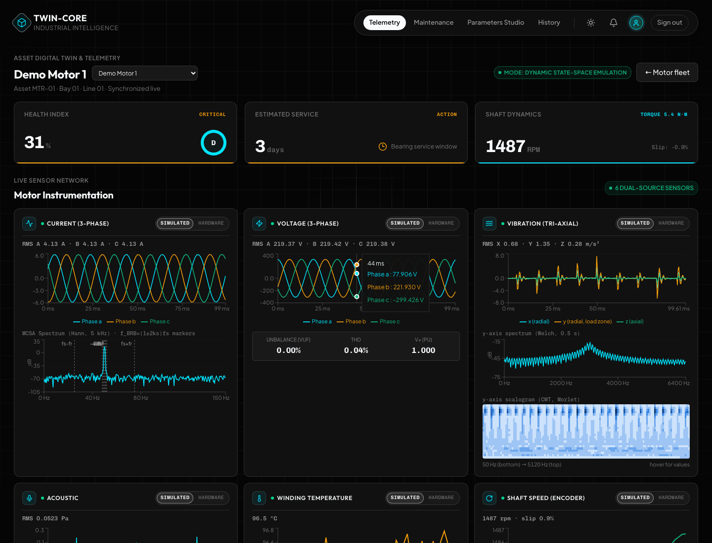

# AC Induction Motor Fault-Detection Digital Twin

A simulation-first digital twin of a 1.5 kW induction motor. It streams six simulated sensor
channels, diagnoses faults with a physics residual method plus a Conv-BiLSTM, fuses the verdicts,
and drives a supervisory layer that derates or trips the motor. A React dashboard shows it live.
Every sensor sits behind an abstraction layer, so real hardware can replace a simulated channel
through configuration. No other code has to change.

See [`implementation.md`](implementation.md) for the original plan and per-phase status.



```
simulator (RK4 plant + fault injectors) ─▶ 6 sensors (sim | hardware) ─▶ diagnostic engine
   electrical DT residual · Conv-BiLSTM vibration/acoustic · thermal · supply ─▶ fusion
   ─▶ SADA (gating, smoothing, derate, trip) ─▶ FastAPI REST + WebSocket ─▶ React dashboard
                                         └▶ MySQL (Alembic) · Redis pub/sub · Prometheus
```

## Quick start (Docker)

```bash
cp .env.example .env          # set passwords and JWT_SECRET
docker compose up --build     # mysql, redis, one-shot migration, backend, frontend
```

Open http://localhost:8080 and sign in with `ADMIN_USERNAME` / `ADMIN_PASSWORD`. A demo motor is
created on first start. The API docs are at http://localhost:8080/api/v1/docs.

Set `INSTALL_ML=false` as a build arg to skip PyTorch. The vibration channel then uses the
rule-based fallback, and everything else works the same.

## Local development

```bash
# backend (Python 3.11+)
cd backend
python -m venv .venv && . .venv/bin/activate
pip install -r requirements-dev.txt          # hash-pinned
pip install torch --index-url https://download.pytorch.org/whl/cpu   # optional (ML channel)
DATABASE_URL=sqlite:///./dev.db AUTO_CREATE_SCHEMA=true ADMIN_USERNAME=admin ADMIN_PASSWORD=admin-pass-123 \
  uvicorn app.main:create_app --factory --reload --port 8000

# frontend
cd frontend && npm ci && npm run dev         # http://localhost:5173 (proxies /api to :8000)
```

## What is in the box

| Area | Where | Notes |
|---|---|---|
| Motor model | `backend/app/simulation/` | α-β state-space model (Chen et al. Eq. 3/13/14). The event-driven PWM twin (`motor_twin.py`) is the high-fidelity reference. The live system runs a fixed-step RK4 averaged-inverter plant (`plant.py`), checked against the PWM twin within 5 % on fundamental current and speed. |
| Fault injectors | `simulation/faults.py` | Broken rotor bar, inter-turn short, eccentricity, bearing IR/OR/ball, unbalance, misalignment, voltage sag/imbalance/harmonics. Each is parameterized by severity. Tests assert each fault's spectral signature. |
| Sensors | `backend/app/sensors/` | Current, voltage, speed, temperature, tri-axial vibration, acoustic. `SensorRegistry` switches each channel between simulated and hardware. The hardware classes are placeholders behind a circuit breaker and report `stale`. |
| Electrical diagnosis | `diagnostics/electrical.py` | A frozen healthy twin is driven by the measured voltage and speed. It computes the FD/FL indices and classifies the fault from the residual spectrum. No ML. |
| Vibration/acoustic ML | `diagnostics/features.py`, `diagnostics/ml/` | 28 features × 4 channels per 0.5 s window with a 0.2 s hop. The model is Conv(32)→Conv(64)→BiLSTM(64). Training is leak-safe: grouped by run, normalization fitted on training data only, 3 seeds. A rule-based fallback takes over if torch or the model is unavailable. |
| Thermal / supply | `diagnostics/thermal.py`, `supply.py` | Thermal uses a threshold plus rate-of-rise check. Supply uses VUF, THD and sag, so supply problems are not mistaken for motor faults. |
| Fusion | `diagnostics/fusion.py`, `schema.py` | Weighted voting. The output schema is frozen at v1.0. |
| SADA | `supervisory/sada.py` | Confidence gate, EMA smoothing, graded derate from 100 % to 50 %, latched trip, emergency and thermal trips, and operator ack, reset and manual load. |
| API | `backend/app/api/` | `/api/v1/...` REST, and a WebSocket at `/api/v1/ws/motors/{id}/stream`. JWT auth with viewer/operator/admin roles on every route. Idempotency keys, rate limits, Pydantic validation. |
| Runtime | `backend/app/runtime/` | One supervised worker per motor with restart backoff. Batched DB writer. In-memory or Redis broker, with a per-motor ownership lock for multiple replicas. Retention job. |
| Observability | `core/logging.py`, `core/metrics.py`, `deploy/` | JSON logs carry the request id and motor id. `/metrics`, `/healthz` and `/readyz` are exposed. Prometheus alert rules and a Grafana dashboard are provisioned. |
| Frontend | `frontend/` | Fleet operations grid, motor provisioning modal (7 presets + custom dq physics), DSA priority queue, live telemetry deck, health & maintenance view (prognosis, RUL, recommendations), parameters studio, operator profile & live database inspector (MySQL configuration), and operator session controls. |
| Ops | `compose.yaml`, `compose.prod.yaml`, `deploy/`, `.github/workflows/ci.yml` | Local and production stacks, TLS edge, backups with a tested restore check, CI/CD. See [docs/operations.md](docs/operations.md). |

## API summary

```
POST /api/v1/auth/login | /auth/refresh      GET /api/v1/auth/me      GET|POST /api/v1/users (admin)
GET  /api/v1/system/db-status                POST /api/v1/system/db-test (test/apply MySQL password)
GET  /api/v1/motors                          POST /api/v1/motors (admin)
GET  /api/v1/motors/{id}                     details + current state
PATCH /api/v1/motors/{id}/load               process load demand (operator)
POST /api/v1/motors/{id}/faults              inject (operator; Idempotency-Key supported)
GET  /api/v1/motors/{id}/faults              DELETE /api/v1/motors/{id}/faults/{fault_id}
GET  /api/v1/motors/{id}/sensors             PATCH /api/v1/motors/{id}/sensors/{sensor_id} (admin)
GET  /api/v1/motors/{id}/diagnoses?start&end&fault_type&limit&offset
GET  /api/v1/motors/{id}/history             GET /api/v1/motors/{id}/alerts, POST .../alerts/{id}/ack
POST /api/v1/motors/{id}/supervisory/override   {action: ack|reset|set_load|release_load, load?}
WS   /api/v1/ws/motors/{id}/stream?token=... (or Sec-WebSocket-Protocol: bearer, <token>)
GET  /healthz  /readyz  /metrics
```

## Tests

```bash
cd backend && pytest -q --cov=app              # 83 tests, ~92 % line coverage (SQLite)
TEST_DATABASE_URL=mysql+pymysql://dt:pw@127.0.0.1:3306/dt_test pytest app/tests/api   # same contract tests on MySQL
TEST_REDIS_URL=redis://127.0.0.1:6379/0 pytest app/tests/runtime
cd frontend && npm test                        # Vitest + Testing Library
npx playwright test                            # E2E: inject fault -> diagnosis -> SADA derate (backend on :8000)
python loadtest/ws_load.py --password ... --motors 2 --viewers 100   # load test, see loadtest/RESULTS.md
```

Retrain the classifier with `python -m app.diagnostics.ml.train --runs-per-class 40 --seeds 0 1 2`.
Run it from `backend/`. It writes `artifacts/conv_bilstm.pt` and `metrics.json`.

## Limitations (read before trusting results)

- **Everything is validated on simulated data only.** The Conv-BiLSTM scored 100 % test accuracy
  (3 seeds, 48 held-out runs each). That result only shows the simulator's fault signatures are
  easy to separate. It says nothing about accuracy on real motors. Retrain and re-validate on
  measured data before relying on it.
- The fault models are simplified lumped models, documented in `simulation/faults.py`. Examples:
  - Pure static eccentricity can't be observed in an α-β model, so it is modelled as mixed eccentricity.
  - Inter-turn heating uses an explicit hot-spot factor.
- The residual thresholds (`FD_THRESHOLD` and others) were tuned against this simulator's noise
  floor. They must be re-tuned for real sensors.
- `CHEN_2025_MOTOR` in `params.py` gives σ ≈ 0.77. That is unrealistic, and these values were not
  re-checked against the paper. The live twin uses `DEFAULT_MOTOR` instead: a widely used 1.5 kW
  parameter set whose origin I have not independently verified.
- The thermal time constant is shortened to 180 s so demos show thermal behaviour. Real TEFC
  motors take tens of minutes.
- One backend process sustains about 2–3 motors, or about 50–100 viewers at the full 10 Hz. Scale
  out with replicas. See `loadtest/RESULTS.md`.
- The hardware sensor classes are placeholders. MySQL table partitioning is not implemented; the
  retention job deletes old rows instead. The rate limiter is per process.
